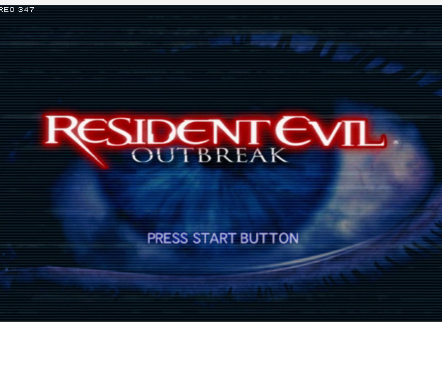

# REO - Resident Evil Outbreak: Recompiled

**A static recompilation of Resident Evil Outbreak (File #1 + File #2) for modern Windows.**

No emulator. No compromises. Just Raccoon City, running natively on your PC — alone or online.


*RE Outbreak title screen rendering natively on Windows 11 — no emulator*

> **Fan project.** Not affiliated with Capcom, Sony, or obsrv.org. You need legally owned copies of the games.

---

## What Is This?

REO takes the original PS2 binaries of both Resident Evil Outbreak games and translates them — instruction by instruction — into native x86-64 code that runs directly on Windows 11. This is **static recompilation**, the same technique behind projects like [Zelda 64: Recompiled](https://github.com/N64Recomp/N64Recomp).

| Game | Serial | Functions | Recompiled |
|------|--------|-----------|------------|
| RE Outbreak | SLUS-20765 | 3,461 | 3,209 functions → 3,829 C++ files |
| RE Outbreak: File #2 | SLUS-20984 | 3,525 | 3,525 functions → 3,892 C++ files |

Both games share the same engine and build against the same runtime HAL.

The PS2 was a wild machine. The Emotion Engine, two Vector Units, a fixed-function Graphics Synthesizer, a sound chip with its own CPU, and a network stack built for 2003-era Japanese broadband. Every piece of that hardware gets replaced with modern equivalents:

| PS2 Hardware | REO Replacement |
|---|---|
| Emotion Engine (R5900 MIPS) | Static recompilation → native x86-64 |
| Vector Units (VU0/VU1) | SSE/AVX SIMD + custom microcode translator |
| Graphics Synthesizer | Vulkan renderer (via paraLLEl-GS or custom) |
| SPU2 Sound | Software mixer → Windows audio (WASAPI) |
| IOP (I/O Processor) | High-level emulation of IRX modules |
| PS2 Network Adapter | Native Winsock, compatible with obsrv.org |
| DNAS Authentication | Bypassed (servers are long dead) |
| DualShock 2 | XInput / DirectInput / keyboard+mouse |

## Online Play

The original RE Outbreak was one of the first PS2 games with online multiplayer — and it was *great*. When Capcom shut down the servers, the community at [obsrv.org](https://obsrv.org) brought them back.

REO connects to those same community servers. Play with friends, matchmake with strangers, survive together — just like 2004, but at 1080p+ and 60fps.

- **Connect to obsrv.org** — join the existing community
- **Self-host** — run your own server for LAN parties or private games
- **Offline** — full single-player with AI partners, no internet required

## How It Works

### The Pipeline

```
┌─────────────┐     ┌──────────────┐     ┌───────────────┐     ┌──────────────┐
│  Outbreak    │     │ ps2xAnalyzer │     │  ps2xRecomp   │     │  REO Runtime │
│  ISO/ELF    │────▶│  (analysis)  │────▶│  (MIPS→C++)   │────▶│  (HAL+game)  │
│  SLUS_207.65│     │  TOML config │     │  native code  │     │  reo.exe     │
└─────────────┘     └──────────────┘     └───────────────┘     └──────────────┘
                                                                       │
                                              ┌────────────────────────┤
                                              ▼                        ▼
                                         ┌─────────┐           ┌────────────┐
                                         │ Vulkan  │           │  Network   │
                                         │Renderer │           │  Stack     │
                                         │ (GS)    │           │ (obsrv.org)│
                                         └─────────┘           └────────────┘
```

1. **Extract** the ELF binary from your legal game disc/ISO (File #1 or File #2)
2. **Analyze** it with ps2xAnalyzer to map functions, relocations, and symbols
3. **Recompile** MIPS R5900 instructions to C++ with ps2xRecomp
4. **Link** against the REO runtime — our replacement for all PS2 hardware
5. **Play** natively on Windows — choose which game with `--game file1` or `--game file2`

### The Runtime (Hardware Abstraction Layer)

The recompiled game code thinks it's talking to PS2 hardware. The REO runtime intercepts every hardware access and translates it:

- **Memory** — 32MB unified address space with scratchpad, MMIO regions, and TLB support
- **Graphics** — GS register writes are captured and rendered via Vulkan compute shaders
- **Audio** — SPU2 ADPCM voices mixed in software, output via WASAPI
- **Input** — DualShock 2 reads mapped to modern controllers and keyboard
- **Network** — IOP network module calls translated to native TCP/IP sockets
- **Filesystem** — CD/DVD reads redirected to extracted game data on disk
- **Video** — Sofdec/SFD cutscenes decoded via FFmpeg
- **Timing** — EE/IOP cycle counting replaced with high-resolution Windows timers

## Project Structure

```
reo/
├── CMakeLists.txt           # Top-level build
├── README.md                # You are here
│
├── game_data/               # Extracted File #1 data (SLUS_207.65 + assets)
├── game_data_file2/         # Extracted File #2 data (SLUS_209.84 + assets)
│
├── tools/                   # Build-time and debug tools
│   ├── iso_extract/         # Extract game files from ISO/BIN
│   ├── elf_analyze/         # ELF analysis and symbol extraction
│   ├── vu_disasm/           # VU microcode disassembler
│   ├── gs_dump_replay/      # GS dump replay tool (validates renderer)
│   └── ps2_debug/           # PCSX2 Pine IPC scripts (overlay dump, GS capture)
│
├── recomp/                  # Static recompilation layer
│   ├── config/
│   │   ├── outbreak.toml        # PS2Recomp config — File #1
│   │   ├── outbreak_file2.toml  # PS2Recomp config — File #2
│   │   ├── output/              # 3,830 recompiled C++ files (File #1)
│   │   ├── output_file2/        # 3,892 recompiled C++ files (File #2)
│   │   └── output_overlay/      # 95 runtime overlay functions (0x370000+)
│   ├── overrides/           # Game-specific overrides + hardware bridge
│   └── patches/             # Binary patches and fixups
│
├── runtime/                 # Hardware Abstraction Layer
│   ├── core/                # CPU context, memory map, syscalls
│   ├── gs/                  # Graphics Synthesizer → Vulkan
│   ├── spu2/                # Sound processing → WASAPI
│   ├── vu/                  # Vector Unit microcode execution
│   ├── iop/                 # I/O Processor HLE
│   ├── input/               # Controller/keyboard mapping
│   ├── cdvd/                # Disc I/O → file system
│   └── timer/               # Timing and vsync
│
├── network/                 # Online play
│   ├── snap_client/         # SN@P protocol implementation
│   ├── dnas/                # DNAS auth bypass
│   ├── lobby/               # Lobby browser and matchmaking
│   └── server/              # Optional local server
│
├── media/                   # Media decoders
│   ├── adx/                 # CRI ADX audio decoder
│   ├── sofdec/              # CRI Sofdec video decoder
│   └── tim2/                # TIM2 texture converter
│
├── game/                    # Game-specific code
│   ├── formats/             # NBD, AMO, RDT, etc. file parsers
│   ├── scripts/             # Game script interpreter
│   └── ui/                  # Menu and HUD reimplementation
│
└── third_party/             # External dependencies
    ├── PS2Recomp/           # Static recompilation toolchain
    ├── parallel-gs/         # Vulkan GS renderer
    ├── SDL3/                # Window/input management
    └── volk/                # Vulkan loader
```

## Building

> **Prerequisites:** Visual Studio 2022, CMake 3.20+, Vulkan SDK, legally owned RE Outbreak NTSC-U ISO(s)

```bash
# Clone
git clone https://github.com/sp00nznet/reo.git
cd reo

# Clone PS2Recomp (recompilation toolchain)
git clone https://github.com/ran-j/PS2Recomp.git third_party/PS2Recomp

# Build PS2Recomp tools
cd third_party/PS2Recomp
cmake -S . -B out/build -G "Visual Studio 17 2022" -A x64
cmake --build out/build --config Release
cd ../..

# Build REO tools
cmake -B build -G "Visual Studio 17 2022" -A x64
cmake --build build --config Release

# ── File #1 (SLUS-20765) ──
./build/tools/iso_extract/Release/reo-extract.exe "Outbreak.iso" game_data
./third_party/PS2Recomp/out/build/ps2xAnalyzer/Release/ps2_analyzer.exe \
    game_data/SLUS_207.65 recomp/config/outbreak.toml
./third_party/PS2Recomp/out/build/ps2xRecomp/Release/ps2_recomp.exe \
    recomp/config/outbreak.toml

# ── File #2 (SLUS-20984) ──
./build/tools/iso_extract/Release/reo-extract.exe "OutbreakFile2.iso" game_data_file2
./third_party/PS2Recomp/out/build/ps2xAnalyzer/Release/ps2_analyzer.exe \
    game_data_file2/SLUS_209.84 recomp/config/outbreak_file2.toml
./third_party/PS2Recomp/out/build/ps2xRecomp/Release/ps2_recomp.exe \
    recomp/config/outbreak_file2.toml

# Rebuild with recompiled code
cmake --build build --config Release

# Run (choose game)
./build/recomp/Release/reo_recomp.exe --game file1
./build/recomp/Release/reo_recomp_file2.exe --game file2
```

### Current Status

The recompilation pipeline is **working for both games**. File #1 boots to its main loop with the full rendering pipeline active, hardware bridge connecting recompiled code to native subsystems, live controller input, and disc I/O infrastructure wired.

| | File #1 | File #2 |
|---|---|---|
| ISO extraction | all files extracted | all files extracted |
| ELF analysis | 3,461 functions | 3,525 functions |
| MIPS → C++ | 3,209 → 3,830 files (66 MB) | 3,525 → 3,892 files (68 MB) |
| Runtime overlays | 95 functions (0x370000+) | pending |
| Build | compiles clean (3,923 files) | compiles clean (3,892 files) |
| Boot | **rendering game textures** | pending |

**File #1 rendering progress:**
- ELF loads, entry point executes, main loop runs continuously at 60fps with 6 active tasks
- **Textured rendering working** — game texture data from NETBIO archives visible on screen through GS software rasterizer
- **Full scene render chain executing** — 193KB scene renderer (sub_001D3DC0) runs every frame: scene lookup → render target allocation → scene builder → render finalization
- **GS software rasterizer** — supports flat sprites, textured sprites (PSMCT32 + PSMT8 indexed), GIF IMAGE mode (swizzled VRAM upload), A+D register writes, XYOFFSET, scissor clipping, alpha test (TEST_1), alpha blending, PSMCT32 VRAM swizzle tables
- **NETBIO archive reader** — parses AFS archives including nested romdata_usa.afs (1,342 game files), loads NBD scene data
- **Live controller input** — XInput controllers and keyboard wired to game's pad buffer
- **SIF RPC bridge** — PS2Recomp dispatches to CDVD/PADMAN/MCSERV/LIBSD handlers
- **CDVD filesystem** — 85 game files mapped from extracted game_data/
- **GIF DMA pipeline** — display list double-buffering, tag array management, DMA source chain traversal
- 95 runtime overlay functions + 30+ HLE function overrides for boot/rendering chain
- Binary trace logger + PCSX2 Pine IPC debug tools + NETBIO archive tools

**Rendering pipeline (15 stages unblocked):**
```
SIF Init → Module Load → Task Wait → Display Flush → Render Dispatch →
TIM2 Bypass → DL Alloc → Task Creation → Buffer Recycle → Scene Lookup →
Render Target → DMA Buffer → Scene DRAW → Scene Builder → GIF→GS ✅
```

**Resolved issues (25+ fixes):**
- SIF DMA status check, SifLoadModule HLE, memcpy counter wrap
- IOP task wait bypass, display list flush bypass, render dispatch dual entry
- TIM2 validation bypass, display list HLE allocator, DMA buffer allocator
- Render target allocator chain (128F80→128F28→1303D8)
- Scene builder + render finalization stubs for uninitialized render contexts
- TEX0 register storage bug, VRAM page conflict for texture uploads
- Multiple mid-function entry points registered (0x13F998, 0x37A5A0)
- Per-frame task table + DMA channel + display list write pointer recycling

**Debug tools:**
- `reo-gs-replay` — replays PCSX2 GS dumps through REO's GS renderer
- `reo-gs-gen-test` — generates synthetic GS test dumps
- `dump_task_table.py` — PCSX2 Pine IPC script for capturing game state
- Binary trace logger — records DMA/GIF/VU/GS events (`REO_TRACE=1`)
- NetbioReader — streaming access to NETBIO/AFS archives without full memory load

**Milestones:**
- **2025-03-13:** Proof of life — debug overlay on live GS framebuffer
- **2025-03-19:** First rendered pixels — flat colored sprites visible on screen
- **2025-03-19:** First textured rendering — game texture data rendered through GIF→GS pipeline
- **2025-03-20:** **Title screen rendered** — RE Outbreak title screen with correct colors displayed natively on Windows, including the eye graphic, "RESIDENT EVIL OUTBREAK" logo, and "PRESS START BUTTON" text
- **2025-03-21:** **GS dump replay working** — PCSX2 GS dumps replayed through REO's software rasterizer with correct output. Title screen and in-game demo scenes render pixel-accurate with PSMCT32 textures, PSMT8 indexed textures, GS VRAM swizzle tables, XYOFFSET coordinate correction, and TEST_1 alpha test support
- **2025-03-28:** **NBD geometry parsing** — reverse-engineered NBD/AMO binary format, rendering 3D game models (rooms + characters) from NETBIO archives with triangle strip support
- **2025-04-07:** **TEX chunk decompression** — reverse-engineered RE Outbreak's custom OB-LZ77 compression, all game textures (256x256 IDX8 with CLUT) decompress and decode correctly
- **2025-04-07:** **PS2Recomp upstream sync** — synced with latest PS2Recomp runtime + applied 5 critical codegen fixes (VU0 dest-mask, divide-by-zero, 64-bit branches) from community contributor jlsandri

## Roadmap

### Phase 1 — Foundation (Current)
- [x] Project structure and build system
- [x] ISO extraction and ELF analysis tooling (working for both games)
- [x] PS2Recomp integration — **File #1: 3,461 functions, File #2: 3,525 functions**
- [x] Dual-game build system (reo_recomp + reo_recomp_file2)
- [x] Game selection via --game flag and auto-detected data paths
- [x] Basic memory map and CPU context runtime (32MB RAM, MMIO, scratchpad)
- [x] Bridge recompiled code to REO runtime (82+ override bindings)
- [x] Boot to main loop (game update function executing)
- [x] Runtime overlay capture — 95 functions from PCSX2 Pine IPC
- [x] Hardware bridge (DMA/GIF/VU/GS interception layer)
- [x] Un-stub rendering pipeline (13 core functions)
- [x] Debug tooling (GS dump replay, binary trace logger, PCSX2 IPC scripts)
- [x] GIF DMA pipeline flowing (display list → tag commit → DMA chain → GSRenderer)
- [x] Render first frame (proof of life — debug overlay on live GS framebuffer)

### Phase 2 — See Something (Current)
- [x] Input system — XInput controllers + keyboard mapped to DualShock 2
- [x] SIF RPC bridge — PS2Recomp dispatches to CDVD/PADMAN/MCSERV/LIBSD handlers
- [x] CDVD filesystem — game files mapped from extracted data
- [x] SIF module loading — SifLoadModule HLE for IOP address loads
- [x] GS software rasterizer — flat sprites, textured sprites, VRAM texture upload
- [x] NETBIO archive reader — parse AFS archives, load NBD game data
- [x] Scene render chain — 15 stages unblocked, full DRAW cycle executing
- [x] **First game textures rendered on screen**
- [x] **Title screen rendered with correct colors**
- [x] NBD/AMO geometry parser — reverse-engineered binary format, room + character models
- [x] TEX chunk decompression — OB-LZ77 custom compression, TIM2 texture decoding (IDX8/IDX4/RGBA32)
- [x] GS dump replay — replay PCSX2 GS dumps through REO's renderer (title + demo scenes verified)
- [ ] Upload decoded textures to GS VRAM — textured 3D model rendering
- [ ] Wire NBD scene data to scene manager — enable game's own rendering
- [ ] GS renderer (Vulkan) — upgrade from software rasterizer
- [ ] VU microcode translation for geometry
- [ ] SPU2 audio mixer — hear the first sound

### Phase 3 — Play Something
- [ ] Full game boot to main menu
- [ ] Sofdec FMV playback
- [ ] Save/load system (memory card → local files)
- [ ] Single-player gameplay loop

### Phase 4 — Connect
- [ ] SN@P network protocol client
- [ ] DNAS bypass for obsrv.org connectivity
- [ ] Lobby browser and matchmaking
- [ ] Online multiplayer gameplay
- [ ] Optional local server bundling

### Phase 5 — Polish
- [ ] 60fps support (original was 30fps locked)
- [ ] Resolution scaling and widescreen
- [ ] Modern graphics enhancements
- [ ] Keyboard+mouse controls
- [ ] Steam Deck / Linux support (stretch goal)

## Technical References

- [PS2Recomp](https://github.com/ran-j/PS2Recomp) — Static recompilation toolchain for PS2
- [paraLLEl-GS](https://github.com/Arntzen-Software/parallel-gs) — Vulkan compute GS renderer
- [obsrv.org](https://obsrv.org/) — Community Outbreak servers
- [obsrv-pack](https://github.com/adrianopteodoro/obsrv-pack) — Open source server bundle
- [Outbreak Research](https://outbreak-research.github.io/Documentation/) — File format documentation
- [REOF2](https://github.com/caprado/REOF2) — RE Outbreak File #2 decompilation (reference)
- [libthanatos](https://github.com/Fothsid/libthanatos) — RE Outbreak NBD/TEX parser + OB-LZ77 compression (reference)
- [OBTool](https://github.com/Fothsid/OBTool) — RE Outbreak modding tool, TIM2 texture handling (reference)
- [ghidra-emotionengine-reloaded](https://github.com/chaoticgd/ghidra-emotionengine-reloaded) — PS2 Ghidra plugin
- [PS2Tek](https://psi-rockin.github.io/ps2tek/) — PS2 hardware documentation
- [Copetti PS2 Architecture](https://www.copetti.org/writings/consoles/playstation-2/) — Architecture deep-dive

## Legal

This project contains **no copyrighted game code or assets**. You must provide your own legally obtained copies of Resident Evil Outbreak (SLUS-20765) and/or RE Outbreak: File #2 (SLUS-20984).

Resident Evil is a trademark of Capcom. PlayStation is a trademark of Sony. This is an independent fan project created for preservation and educational purposes.

## Contributing

This is a massive undertaking and help is welcome. If you know PS2 internals, MIPS assembly, Vulkan, or just really love Outbreak — open an issue or PR.

*Don't let the memory of Raccoon City die.*
